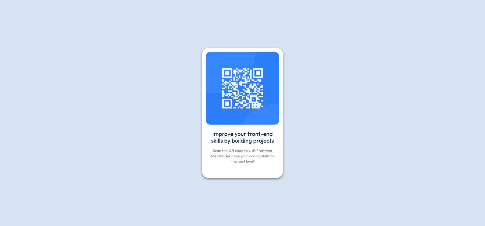

# Frontend Mentor - QR code component solution

This is a solution to the [QR code component challenge on Frontend Mentor](https://www.frontendmentor.io/challenges/qr-code-component-iux_sIO_H). Frontend Mentor challenges help you improve your coding skills by building realistic projects.

## Table of contents

- [Overview](#overview)
  - [Screenshot](#screenshot)
  - [Links](#links)
- [My process](#my-process)
  - [Built with](#built-with)
  - [What I learned](#what-i-learned)
  - [Continued development](#continued-development)
  - [Useful resources](#useful-resources)
- [Author](#author)
- [Acknowledgments](#acknowledgments)

**Note: Delete this note and update the table of contents based on what sections you keep.**

## Overview

### Screenshot



### Links

- Solution URL: [GitHub](https://github.com/AntoineMu/qr-code-component)
- Live Site URL: [GitHub Pages](https://antoinemu.github.io/QR-Code-Component/)

## My process

### Built with

- HTML
- CSS

### What I learned

This project allowed me to practice the concecpts i've been reading about. I learned that by default the body element does not take up all of the page (in regards to height). It only takes up as much as there is content. So in order to center my component, I used CSS to make the body element take up the entire height of the page.

```css
html,
body {
  height: 100%;
  margin: 0;
  padding: 0;
}
```

### Continued development

For future projects I want to focus more on semantic HTML, as well as responsive design. To my understanding, this project is already at least somewhat responsive, but that was more of a side effect and not the main focus. Since the entire page is basically just one component, only the margin of the card is changing when changing the width of the screen, which seems to be the desired outcome to me.

## Author

- Frontend Mentor - [@AntoineMu](https://www.frontendmentor.io/profile/antoinemu)
